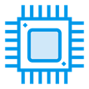

# A KiCAD 8 library for all modern Nordic Semiconductor parts.
<p align="center">
  
</p>

KLC compliance is established using KiCAD's official scripts within the "kicad-library-utils" folder and the "lib_check.sh" script

Compliance for the purposes of this library is defined as zero errors for footprints and symbols. Reasonable warnings about pin position or names may be accepted.

## Installation instructions

Open the KiCAD Plugin and Content Manager (PCM), click "Manage..." in the top right, and add the following URL to your list of repositories:
```
https://raw.githubusercontent.com/nutmeg-project/kicad-registry/nutmeg/main/repository.json
```
Then, using the dropdown in the PCM, switch to "Nutmeg's KiCAD Repository" and click on the "Libraries" tab.

## Seeking pull-requests for any footprint/symbol/3D model marked 🚧

 # nRF9 series - Cellular

|             | Symbol | Footprint | 3D Model | KLC Compliant |
|-------------|--------|-----------|----------|---------------|
| [nRF9160](https://www.nordicsemi.com/products/nrf9160) LGA |✅|✅|✅|🚧|
| [nRF9161](https://www.nordicsemi.com/products/nrf9161) LGA |✅|✅|✅|🚧|

 # nRF7 series - Wi-Fi

|             | Symbol | Footprint | 3D Model | KLC Compliant |
|-------------|--------|-----------|----------|---------------|
| [nRF7002](https://www.nordicsemi.com/products/nrf7002) QFN |✅|✅|✅|🚧| 
| [nRF7001](https://www.nordicsemi.com/products/nrf7001) QFN |✅|✅|✅|🚧| 
| [nRF7000](https://www.nordicsemi.com/products/nrf7000) QFN |✅|✅|✅|🚧| 

 # nRF53 series - Bluetooth Low Energy

|             | Symbol | Footprint | 3D Model | KLC Compliant |
|-------------|--------|-----------|----------|---------------|
| [nRF5340](https://www.nordicsemi.com/products/nrf5340) aQFN |✅|✅|🚧|🚧| 
| [nRF5340](https://www.nordicsemi.com/products/nrf5340) WLCSP |✅|✅|🚧|🚧| 

 # nRF52 series - Bluetooth Low Energy

|             | Symbol | Footprint | 3D Model | KLC Compliant |
|-------------|--------|-----------|----------|---------------|
| [nRF52840](https://www.nordicsemi.com/products/nrf52840) aQFN |✅|✅|✅|🚧| 
| [nRF52840](https://www.nordicsemi.com/products/nrf52840) WLCSP |✅|✅|🚧|🚧| 
| [nRF52840](https://www.nordicsemi.com/products/nrf52840) QFN |✅|✅|✅|🚧| 
| [nRF52833](https://www.nordicsemi.com/products/nrf52833) aQFN |✅|✅|🚧|🚧| 
| [nRF52833](https://www.nordicsemi.com/products/nrf52833) WLCSP |✅|✅|🚧|🚧| 
| [nRF52833](https://www.nordicsemi.com/products/nrf52833) QFN |✅|✅|✅|🚧| 
| [nRF52832](https://www.nordicsemi.com/products/nrf52832) WLCSP |✅|✅|🚧|🚧| 
| [nRF52832](https://www.nordicsemi.com/products/nrf52832) QFN |✅|✅|✅|🚧| 
| [nRF52820](https://www.nordicsemi.com/products/nrf52820) WLCSP |✅|✅|🚧|🚧| 
| [nRF52820](https://www.nordicsemi.com/products/nrf52820) QFN |✅|✅|✅|🚧| 
| [nRF52811](https://www.nordicsemi.com/products/nrf52811) WLCSP |✅|✅|✅|🚧| 
| [nRF52811](https://www.nordicsemi.com/products/nrf52811) QFN-32 |✅|✅|✅|🚧| 
| [nRF52811](https://www.nordicsemi.com/products/nrf52811) QFN-48 |✅|✅|✅|🚧| 
| [nRF52810](https://www.nordicsemi.com/products/nrf52810) WLCSP |✅|✅|✅|🚧| 
| [nRF52810](https://www.nordicsemi.com/products/nrf52810) QFN-32 |✅|✅|✅|🚧| 
| [nRF52810](https://www.nordicsemi.com/products/nrf52810) QFN-48 |✅|✅|✅|🚧| 
| [nRF52805](https://www.nordicsemi.com/products/nrf52805) WLCSP |✅|✅|✅|🚧| 

 # nRF21 series - PA + LNA ICs

|             | Symbol | Footprint | 3D Model | KLC Compliant |
|-------------|--------|-----------|----------|---------------|
| [nRF21540](https://www.nordicsemi.com/products/nrf21540) QFN |✅|✅|✅|✅| 

 # nPM Power Management ICs

|             | Symbol | Footprint | 3D Model | KLC Compliant |
|-------------|--------|-----------|----------|---------------|
| [nPM6001](https://www.nordicsemi.com/products/nPM6001) WLCSP |✅|✅|🚧|✅| 
| [nPM1300](https://www.nordicsemi.com/products/nPM1300) WLCSP |✅|✅|🚧|✅| 
| [nPM1300](https://www.nordicsemi.com/products/nPM1300) QFN |✅|✅|✅|✅| 
| [nPM1100](https://www.nordicsemi.com/products/nPM1100) WLCSP |✅|✅|🚧|✅| 
| [nPM1100](https://www.nordicsemi.com/products/nPM1100) QFN |✅|✅|✅|✅| 

---

## How to create a new release

First make sure to have a valid personal access token generated for the organization. Go into to a repository owner or
administrator account settings. Click on **Developer Settings**, **Personal Access Tokens**, **Fine-grained tokens**.

You should find a token called `kicad-registry automation`. If the token does not exists (e.g. this is a fresh fork) you
will have to create one as follows:

- Click on **Generate New Token**
- Name the token `kicad-registry automation`.
- Choose an expiration
- Set the resource owner to `nutmeg-project`.
- Select the option `Only select repositories`
- Click in **Select Repositories** and mark `nutmeg/kicad-registry`
- Under **Permissions/Repository Permissions/Actions** select  `Read-Write`
- Click on **Generate Token** at the bottom of the page
- Copy the token value as it will be required to create an organization secret

Now we have to create the secret:

- Open the **Nutmeg Project** organization page
- Click on **Settings**
- Under **Secrets and variables** select **Actions**
- In the *Secrets* tab, click on **New organization secret**
- Name it `KICAD_REGISTRY_TOKEN`
- Copy the value of the `kicad-registry automation` token into the *Value* text box
- Under **Repository access** select *Selected repositories*
- Click on the cog icon and select `nutmeg/nordic-lib-kicad`
- Click on **Add secret**

Now with the correct token and secret configured we can create a new release as follows:

1. Tag the release using the format: `nutmeg/YYYY-MM-DD`
2. Add a [new relase](https://github.com/nutmeg-project/nordic-lib-kicad/releases/new)
   - Make sure to select the correct tag you created in the first step (not a branch!)
   - Leave the title empty so it will use the tag name by default.
   - Description is optional
3. The `KiCAD PCM packaging` workflow should automatically run.
   It is located in [Actions](https://github.com/nutmeg-project/nordic-lib-kicad/actions)
4. After the release is updated the catalog at nutmeg-project/kicad-repository should be automatically rebuilt to add
   the new package.
5. Open https://github.com/nutmeg-project/kicad-registry and check that the `packages.json` has been updated. The last
   commit message should also indicate the package version added.
